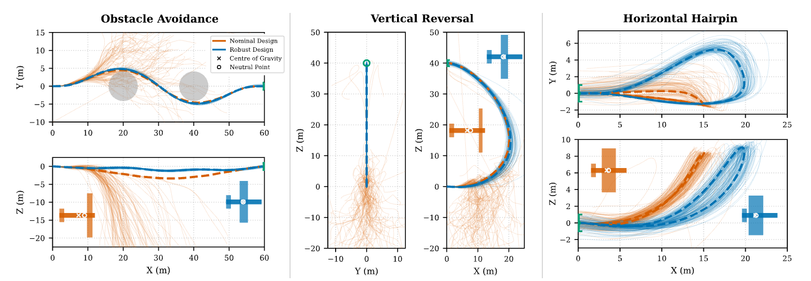

<div align="center">
  <h1>Robust Co-design Optimisation for Agile Fixed-Wing UAVs</h1>
  <h3><b>Adrian A. Buda</b><sup>1</sup>, 
    <b>Xavier Chen</b><sup>1</sup>, 
    <b>Nicol&ograve Botteghi</b><sup>2</sup>,
    <b>Urban Fasel</b><sup>1</sup></h3>

  <p>
    <sup>1</sup><i>Department of Aeronautics, Imperial College London, United Kingdom</i><br>
    <sup>2</sup><i>Department of Mathematics, Politecnico di Milano, Italy</i>
  </p>
</div>

---

### Abstract
Co-design optimisation of autonomous systems has emerged as a powerful alternative to sequential approaches by jointly optimising physical design and control strategies. However, existing frameworks often neglect the robustness required for autonomous systems navigating unstructured, real-world environments. For agile Unmanned Aerial Vehicles (UAVs) operating at the edge of the flight envelope, this lack of robustness yields designs that are sensitive to perturbations and model mismatch. To address this, we propose a robust co-design framework for agile fixed-wing UAVs that integrates parametric uncertainty and wind disturbances directly into the concurrent optimisation process. Our bi-level approach optimises physical design in a high-level loop while discovering nominal solutions via a constrained trajectory planner and evaluating performance across a stochastic Monte Carlo ensemble using feedback LQR control. Validated across three agile flight missions, our strategy consistently outperforms deterministic baselines. The results demonstrate that our robust co-design strategy inherently tailors aerodynamic features, such as wing placement and aspect ratio, to achieve an optimal trade-off between mission performance and disturbance rejection.

---

### Getting Started

**Clone the Repository:**
   ```bash
   git clone https://github.com/adrianbuda30/robust_UAV.git
   cd robust_UAV
   ```
   
**Install the dependencies:**
   ```bash
   conda env create -n <env-name> --file environment.yml
   conda activate <env-name>
   ```

### Usage

1. **Run the <i>nominal</i> and <i>robust</i> co-design optimisation on the three tasks:**
   
   * **Obstacle Avoidance** - Navigates through two cylindrical obstacles without collisions.
     * [codesign_nominal_obstacles.py](./codesign_nominal_obstacles.py)
     * [codesign_robust_obstacles.py](./codesign_robust_obstacles.py) 
   
   * **Vertical Reversal** - Performs a full 180° pitch-up loop starting from level flight.
     * [codesign_nominal_verticalreversal.py](./codesign_nominal_verticalreversal.py)
     * [codesign_robust_verticalreversal.py](./codesign_robust_verticalreversal.py) 
   
   * **Horizontal Hairpin** - Performs a horizontal 180° loop and returns to the original position.
     * [codesign_nominal_horizontalhairpin.py](./codesign_nominal_horizontalhairpin.py)
     * [codesign_robust_horizontalhairpin.py](./codesign_robust_horizontalhairpin.py)

> **Note:** The level of parametric uncertainty (*sigma_des*) and wind disturbances (*w_gust*) for the robust scenarios can be selected within the scripts (tested for up to 10% *sigma_des*).

We run our co-design optimisation on an Intel Icelake Xeon Platinum 8358 machine, with the CMA-ES search parallelised across 32 CPU cores. The optimisation takes an average of ∼27.4 hours to converge, and evaluates 3200 or 4800 design candidates depending on the task. 

---
  
2. **Perform the post-optimisation robustness analysis on the <i>nominal</i> or <i>robust</i> optimal designs discovered in the optimisation:**
   
     * [robustness_analysis_obstacles.py](./robustness_analysis_obstacles.py)
     * [robustness_analysis_verticalreversal.py](./robustness_analysis_verticalreversal.py)
     * [robustness_analysis_horizontalhairpin.py](./robustness_analysis_horizontalhairpin.py)
  
> **Note:** The optimal design to be tested can be found in the **results** section and loaded into the *TRAJ_FILE* (line 14). The script evaluates the design (nominal or robust) against a preset level of parametric uncertainty (*sigma_des*) and wind disturbances (*w_gust*).

---

3. **Perform the postprocessing to visualise the <i>nominal</i> or <i>robust</i> designs and the trajectories across the ensemble of stochastic simulations:**
   
     * [postprocess_obstacles.py](./postprocess/postprocess_obstacles.py)
     * [postprocess_verticalreversal.py](./postprocess/postprocess_verticalreversal.py)
     * [postprocess_horizontalhairpin.py](./postprocess/postprocess_horizontalhairpin.py)
  
<p align="center">
  
</p>

### Citation

This work has been submitted to the  **2026 International Conference on Unmanned Aircraft Systems (ICUAS)** and is currently under review. Please cite:

```bibtex
@inproceedings{budarobustUAV,
  title={Robust Co-design Optimisation for Agile Fixed-Wing UAVs},
  author={Buda, Adrian Andrei and Chen, Xavier and Botteghi, Nicol\'o, and Fasel, Urban},
  booktitle={2026 International Conference on Unmanned Aircraft Systems (ICUAS)},
  year={2026},
  note={Under review},
  url={[https://github.com/adrianbuda30/robust_UAV](https://github.com/adrianbuda30/robust_UAV)}
}
```
   
